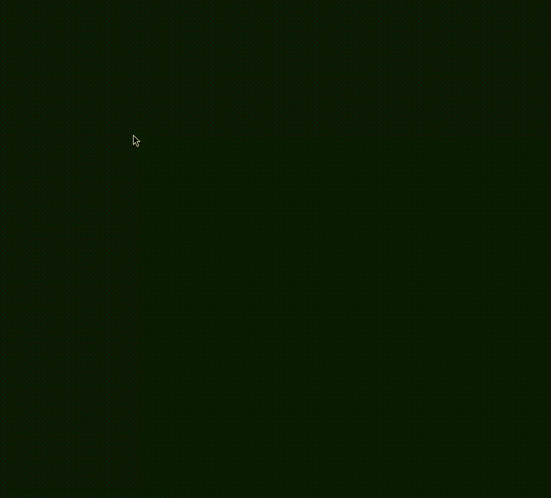

# Flutter Custom Gauge Chart

This project demonstrates how to create a custom animated gauge chart in Flutter using the `CustomPaint` widget.  The chart is divided into segments, each representing a different part of a whole, and animates smoothly to display progress.

## Video Demo



## Features

* **Multi-Segment Gauge:**  Visualizes progress with multiple colored segments.
* **Smooth Animations:**  Segments fill up smoothly using animations.
* **Customizable:**  Easily change colors, stroke width, labels, and overall appearance.
* **Reusable Widget:**  The `MultiSegmentGauge` widget can be easily integrated into your projects.

## Getting Started

1. Clone this repository.
2. Run `flutter pub get` to install dependencies.
3. Run the app using `flutter run`.


## Usage

Add the `MultiSegmentGauge` widget to your UI and provide a list of `GaugeSegment` objects:

```dart
MultiSegmentGauge(
  title: 'Project Progress',
  segments: [
    GaugeSegment(label: 'Design', progress: 35, color: Colors.blue),
    GaugeSegment(label: 'Development', progress: 45, color: Colors.green),
    GaugeSegment(label: 'Testing', progress: 20, color: Colors.orange),
  ],
)
```

## Customization

You can customize the gauge chart by modifying the following properties of the `MultiSegmentGauge` widget:

* `segments`:  The list of `GaugeSegment` objects defining the segments of the gauge.
* `radius`: The radius of the gauge.
* `strokeWidth`: The width of the gauge segments.
* `title`: The title displayed in the center of the gauge.

You can also customize the appearance of individual segments by modifying the `label`, `progress`, and `color` properties of the `GaugeSegment` objects.


## Code Overview

The `MultiSegmentGauge` widget is a stateful widget that manages the animation and drawing of the gauge.  It uses an `AnimationController` to drive the animation and a `CustomPaint` widget with a `GaugePainter` to draw the gauge segments.

The `GaugePainter` class extends `CustomPainter` and overrides the `paint` method to draw the gauge segments, labels, and title on the canvas.


## Contributing

Contributions are welcome!  Feel free to open issues or pull requests.